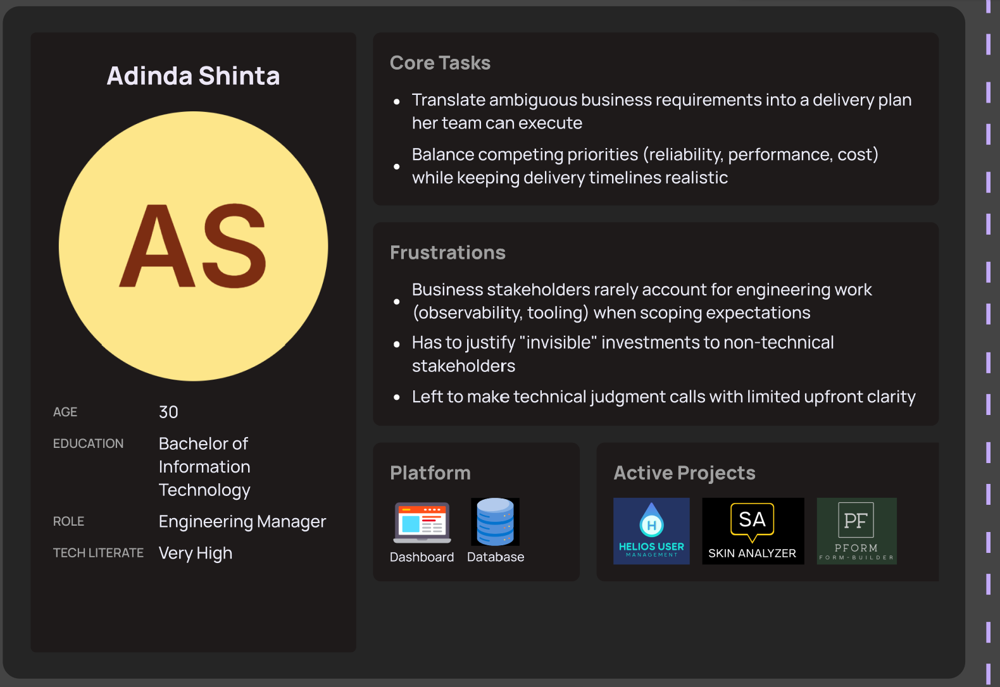
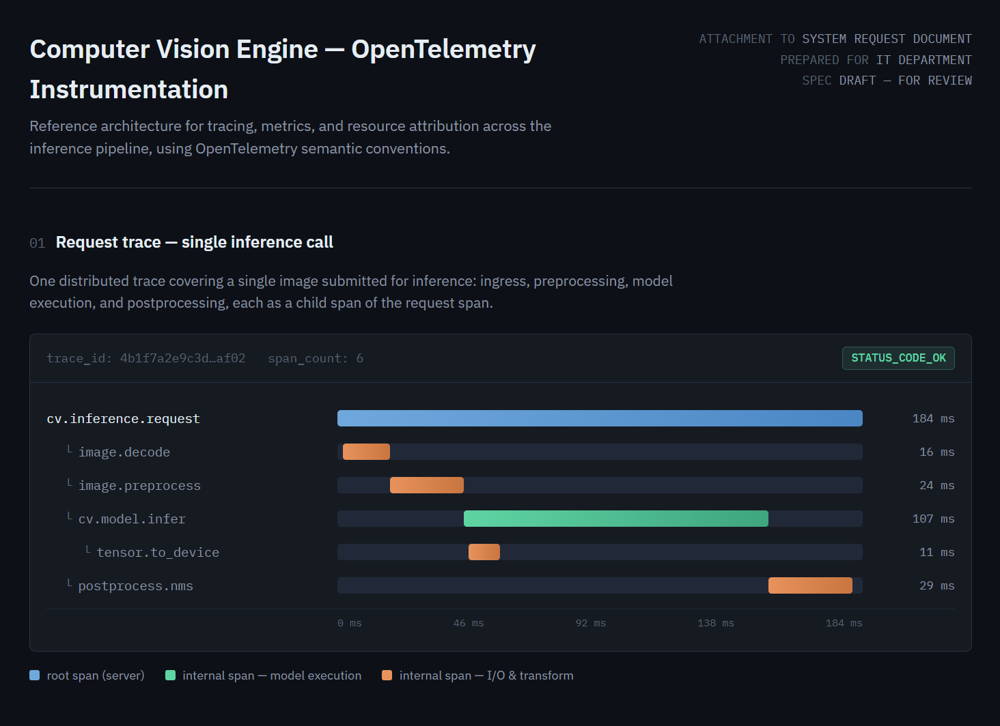

# Project Sponsor

## Context

PT Paragon Technology & Innovation is a beauty and personal-care company founded in 1985 that develops, manufactures, markets, and distributes cosmetics, skincare, haircare, and related products. The company employs more than 14,000 people and operates an extensive distribution network across Indonesia and Malaysia. Its brand portfolio includes Wardah, Make Over, Emina, Kahf, Putri, Crystallure, Instaperfect, Labore, Biodef, Tavi, Wonderly, OMG, Beyondly, Earth Love Life, and DSE Dermascalp Expert. Paragon expanded its presence through local distributors and major retail networks such as Watsons and Guardian.

The company is strengthening its competitive advantage by moving beyond the simple purchase of emerging AI technologies and investing in the development of its own Computer Vision Engine.
By building this capability in-house, the company can tailor AIs to its specific business needs, retain greater control over proprietary data and intellectual property.
Computer vision, a branch of AI that enables systems to interpret images
and video, can support applications such as
virtual try-on experience^[https://vto.wardahbeauty.com/], and in turn, product recommendations.

<!-- This shift reflects a broader transformation from being only a consumer of external AI solutions into an organization capable of creating core AI infrastructure -->
<!-- and translating internal expertise into differentiated products and operational improvements. -->

<!-- product analysis, visual quality inspection, -->
<!-- and automated assessment of visual attributes. -->

## Assignment Topic Fitness

<!-- ??: edit section -->
This proposal satisfies the brief's requirement to incorporate emerging digital technologies because
OpenTelemetry represents the current industry-standard convergence point for observability tooling: it
is a CNCF graduated project, vendor-neutral by design, and increasingly the default instrumentation layer that cloud providers, APM vendors,
and ML platforms are converging around, replacing the fragmented, proprietary tracing SDKs of the previous decade.

Applying it specifically to a computer vision
inference pipeline is a genuinely current problem space rather than a generic instrumentation exercise — CV and ML services have workload characteristics that
traditional web-service observability doesn't naturally cover (GPU device attribution, model versioning, per-stage tensor processing latency), so extending OTel's
semantic conventions into a cv.* namespace demonstrates both technical currency and the ability to adapt an emerging standard to a domain that hasn't yet been fully
standardized.

Combined with the Collector's role in sampling, enrichment, and PII redaction before data reaches any backend, the proposal also touches on responsible-AI-adjacent
data governance concerns that IT departments are increasingly expected to address, which strengthens the case that this is an innovative, forward-looking system design rather
than a routine monitoring add-on.

## Support Manifestation

We identified 2 primary stakeholders for sponsorship of this system proposal document: Technology Product Owner and Engineering Manager.
As project initiator, I have secured verbal agreement for the following needed support points, evidence available in the appendices.

+ Access to the CV Engine API (free of charge)
+ Consultation with internal experts (monthly until end of year, 30–60 minutes each session)

# Business Needs

## Problems
We interviewed our proposed system's projected primary user. 
The following table summarizes the profile of relevant Engineering Manager for the system we propose.

| {width=600}  |
|-----------------------------------|
| Contact: adinda.gdshinta@paracorpgroup.com |
: User Persona {#tbl-persona}

## Opportunities

OpenTelemetry is the default instrumentation and telemetry pipeline standard that has created an opportunity to unify observability across services, reduce vendor lock‑in, and lower total cost of ownership. Evidence from peer engineering teams shows that standardizing on it enables end-to-end trace coverage, consistent metric/trace/log semantics, and self‑service onboarding for dozens of product teams.

<!-- ??: edit and refs as footnotes -->
Based on recent engineering blog posts, several organizations report measurable success after adopting OpenTelemetry.

+ Adobe built a simplified, massive-scale telemetry pipeline with thousands of collectors serving diverse backends; Airbnb migrated to an OTel-based metrics pipeline and now processes 100M+ samples/second while cutting costs by an order of magnitude; STCLab achieved a 72% observability cost reduction and moved from 5% sampled traces to 100% APM coverage; and a platform team embedding OTel into a NestJS SDK reached 90+ internal teams, standardized semantics, and saw a 4× TPS improvement in key workloads. A CNCF survey further notes 95% adoption of OpenTelemetry in new cloud‑native projects in 2026, with many teams citing reduced vendor lock‑in and 40–60% observability bill savings after migrating from commercial APM vendors to OTel-backed stacks.

# Business Requirements

## User Story
As an IT operations engineer responsible for the department's computer vision services, I want end-to-end tracing and standardized metrics across the inference pipeline, so that when a request runs slow or returns an unexpected result, I can see exactly which stage introduced the delay or failure, instead of guessing from application logs alone. Today, when an external vendor or integrator reports that inference results look off for a batch of images, there is no way to correlate a single request across the pipeline layers.

## Deliverable

{fig-align="center" width="100%" fig-cap="Mockup Illustration"}
: Figure: Automatically Generated Mockup Illustration

# Business Value
We approximate expected monetary valuation of our proposed system in 2 analyses: value of having observability (versus not having observability at all) and value of avoiding external service expenses (versus spending on a benchmark external service).
## Opportunity Cost of Having Observability
### Assumptions

| Parameter                                              | Estimated value | Basis / rationale |
|---|---:|---|
| Application integrations per year                      | 7 | Initial adoption scenario |
| Significant integration incidents per integration/year | 4 | 1 incident every 3 months |
| Investigation time without instrumentation             | 6 hours/incident | Logs + reproduction + cross-team investigation |
| Investigation time with instrumentation                | 2 hours/incident | Correlated telemetry narrows the investigation |
| Engineering cost                                       | Rp250.000/hour | Illustrative blended engineering cost |
| Performance/evaluation effort without instrumentation  | 40 hours/integration | Manual resource/performance investigation |
| Performance/evaluation effort with instrumentation     | 20 hours/integration | Automated metrics and standardized reporting |
| Incidents causing prolonged service disruption         | 2/year | Conservative initial assumption |
| Downtime avoided per incident                          | 2 hours | Better detection/diagnosis |
| Operational cost of downtime                           | Rp1.500.000/hour | Conservative business-impact estimate |

## Opportunity Cost of Subscribing to Observability as a Service
A more fair comparison requires a complete list of features that CV Engine would want from an observability platform.
Such list is not available at this stage of the roadmap, so for the purpose of concretizing the monetary cost of subscribing to a service of its kind, we pick Datadog as a representative popular benchmark.

### 2026 Benchmark External Service Pricelist
We looked at Datadog's pricing page^[https://www.datadoghq.com/pricing/?site=ap2].

| Parameter | Value | Remarks |
|---|---:|---|
| Server Site | AP2 (Australia) | AP2 is closer geographically to Jakarta than AP1 (Japan) |
| Pricing Plan | Enterprise | Datadog provides 4-level non-free plans, Enterprise is level 2 |
| Price | USD 27.60 per month | USD 27.60 * 12 months = USD 331.2 annually |

<!-- ## Value of Having Observability -->
<!-- ## Monetary Valuation -->

<!-- We estimated the monetary valuation of our proposed system in 2 separate parts: value of having observability and value of avoiding external service expenses. -->

# Special Issues
We complete our system request proposal by listing issues worth anticipating.

### Implications

+ Application performance overhead: (need citation for "apm implementing software induces performance overhead")

### Critical Success Factors

+ Discipline from application developers and integrators: (need citation for "maintaining apm log statements requires discipline")
+ Business-level demand for system optimizations: (need citation for "system optimization requests are more and more shifting from technical-level demand to business-level demand")

<!-- ## Quotes -->
<!---->
<!-- ::: {lang=de} -->
<!---->
<!-- > Alle Menschen sind frei und gleich an Würde und Rechten geboren. -->
<!---->
<!-- ::: -->
<!---->
<!-- All human beings are born free and equal in dignity and rights. All human beings are born free and equal in dignity and rights. All human beings are born free and equal in dignity and rights. All human beings are born free and equal in dignity and rights. -->
<!---->
<!-- ## Scientific citations -->
<!---->
<!-- > All human beings are born free and equal in dignity and rights. They are endowed with reason and conscience and should act towards one another in a spirit of brotherhood. @unitednations1948 -->
<!---->
<!-- All human beings are born free and equal in dignity and rights. All human beings are born free and equal in dignity and rights. All human beings are born free and equal in dignity and rights. All human beings are born free and equal in dignity and rights.[@unitednations1948] -->
<!---->
# References

::: {#refs}
:::

\appendix

# Appendix A. Interview Questions and Transcripts

## Question Set 1: Project Scope and Sponsorship
The first question set confirms whether our proposal is feasible in terms of scope and timeline.

1. What is the scope and expected impact of the upcoming Computer Vision Engine project?
2. What projects/events/brands will see it in action for the first time?

### Semi-Automated Transcription

| Speaker | Role |
|:-------------|:-----|
| **[I]**      | Interviewer |
| **[TPO]**     | Technology Product Owner |

| | |
|:---|:---|
| **[I]** Iya Mas, mungkin pertama aku konfirmasi dulu Mas Gia ini adalah Technology Produk Officer ya di IT Paragon | |
| | **[TPO]** Iya betul, Technology Product Owner di Paragon |
| **[I]** Oh mohon maaf, Owner ya, oke aku mau mulai dengan pertanyaan pertama, Mas. Bagaimana sebenarnya visi dari Computer Vision Engine ini, mungkin dari segi impact dan scopenya | |
| | **[TPO]** Iya CV Engine itu nanti akan dibangun sebagai salah satu building block Untuk kita bisa menghasilkan suatu rekomendasi produk yang lebih akurat ya. Jadinya, misal customer melakukan scanning wajah gitu ya. Itu harapannya nanti Vision Engine itu akan meng-capture dan menganalisa dengan lebih akurat secara terus menerus, artinya terus menerus kita akan improvement dengan retraining model. Kemudian kita pertajam dari sisi analisa. Tidak hanya dari sisi bentuk wajah, tapi juga dari warna kulit, external factor Contohnya misal UV Index, humidity, dan lain-lain. Nah ini harapannya sebenarnya Vision Engine itu akan membantu kita bisa men-shaping ke customer yang lebih segmented dan targeted. Dan akhirnya nanti produk recommendation yang kita berikan itu memang yang men-solve dan meng-capture isu dari customer itu sendiri. Nah dan harapannya lagi sebenarnya kalau bicara bisnis impactnya ya, kita bisa membuat sesuatu seperti system as a service juga yang nanti bisa kita jual di luar Paragon, yang harapannya nanti akan membawa revenue baru di luar Paragon itu sendiri. Paling mungkin dari aku secara vision-nya itu seperti itu ya |
| **[I]** Baik, untuk awal, project, event, atau brand apa aja mas sudah terlihat akan menggunakan engine-nya | |
| | **[TPO]** Ya kalau untuk project, event, dan brand itu mungkin hampir semua yang akan menggunakan CV Engine ini ya. Mungkin kita akan coba piloting dari beberapa event terlebih dahulu gitu ya. Nah misalnya contohnya event di Wardah ada A.M. Club, nah dia bisa jadi salah satu piloting untuk kita melakukan proses Vision Engine ini. Harapannya sih nanti kita gradually ya, improve dan expand gitu Misalnya dari sisi piloting itu sudah oke Kita coba mulai approach ke existing-existing platform kita ya Yang sudah di brand-brand atau di event-event Mungkin harapannya kita bisa nge-replace yang vendor pernah kerjakan. Jadi semua proses dan data owningnya itu di kita Harapannya sih seperti itu, Mas Reza |
| **[I]** Baik Mas. Kemudian Sebenarnya wawancara ini itu dalam rangka saya itu akan mem-propose sebuah sistem observability seperti itu Mas Untuk diterapkan di engine-nya yang baru nanti. Nah Yang saya mau bertanya, Apakah membagikan video usage dari sistem saya itu yang artinya mungkin menunjukkan data aktual gitu ya dari pengguna-pengguna enginee yang baru itu keluar lingkungan perusahaan apakah dibolehkan, Mas? | |
| | **[TPO]** Ya kalau untuk simulasi ya Simulasi dan juga video Dari sisi performance kita itu dibolehkan Mas, Selama itu bukan data customer ya Dan juga data produk-produk sensitif kita Itu dibolehkan Mas |
| **[I]** Baik, terima kasih Mas. Kemudian pertanyaan terakhir, setelah ini saya akan melakukan juga wawancara dengan stakeholder Yaitu mungkin dari sisi engineeringnya Yang akan menjadi pengguna langsung dari sistem yang akan saya buat begitu. Nah apabila proposal saya nanti dinilai feasible, sponsorship atau dukungan apa saja yang mungkin Mas berikan ya Untuk pengembangan sistem saya? Kalau mungkin secara secara poin-poin itu saya membutuhkan pertama Boleh mengakses API engine yang baru Mungkin diperbolehkan untuk tidak dibilling atau tanpa berbayar begitu Lalu mungkin kedua Kami akan butuh bertanya-tanya yang dalam hal ini konsultasi begitu Yang profesional dengan internal experts. Mungkin kalau di estimasi sampai dengan akhir proyek atau akhir tahun ini Kira-kira setengah sampai satu jam seperti itu Mas. Nah untuk dua hal tersebut Apakah mungkin untuk diberikan? | |
| | **[TPO]** Ya Kalau untuk yang poin satu Nanti kita bisa coba Berikan aksesnya ya. Mungkin nanti bisa Ada beberapa Ini juga ya beberapa kriteria juga ya Yang penting sebenarnya kan Kita tidak mengakses data customer aja. Yang kedua untuk subject matter expert pun sebenarnya Dari sisi kita juga Ada yang mungkin lebih ahli ya dari penggunaan computer vision Misalnya contohnya kayak Kayak Risman gitu ya Atau Mungkin Mas Redha gitu ya Di level Yang lebih atas Nah itu Mungkin mereka bisa lebih expert ya Untuk dijadikan sebagai Konsultasi gitu |
| **[I]** Baik Terima kasih Kalau begitu, boleh saya Konfirmasi Akan didukung lah ya Untuk setidaknya dua Tadi itu Dan mungkin akan diarahkan ke Expert Yang Lebih expert tadi ya Dengan Pak Risman dan Mas Redha | |
| | **[TPO]** Ya betul |
| **[I]** Oke Selanjutnya Boleh dikonfirmasi Mas Ini nanti itu Akan estimasinya Secara roadmap Di Q4 Tahun ini kah Atau seperti apa Mas? | |
| | **[TPO]** Ya Nanti kita Akan mulai start dari Q3 sekarang. Dan harapannya di Q4 itu kita udah bisa cover hampir semua brand ya Menggunakan existing platform kita gitu. Mungkin secara milestone Seperti itu ya Mas Reza |

<!-- ::: {.interview} -->
<!---->
<!-- ::: {.interviewer} -->
<!-- **Interviewer** -->
<!---->
<!-- How do you currently identify performance bottlenecks? -->
<!-- ::: -->
<!---->
<!-- ::: {.interviewee} -->
<!-- **Engineering Manager** -->
<!---->
<!-- Usually through application logs. But the logs don't give us enough -->
<!-- information to pinpoint the issue. -->
<!-- ::: -->
<!---->
<!-- ::: {.interviewer} -->
<!-- **Interviewer** -->
<!---->
<!-- What would you need to diagnose the problem more effectively? -->
<!-- ::: -->
<!---->
<!-- ::: {.interviewee} -->
<!-- **Engineering Manager** -->
<!---->
<!-- We'd need visibility into the different stages of the pipeline. -->
<!-- ::: -->
<!---->
<!-- ::: -->

<!-- Bagaimana visi dari CV Engine ini dari segi impact dan scope-nya? -->
<!---->
<!-- Project atau brand apa saja yang sudah terlihat akan menggunakan CV Engine? -->
<!---->
<!-- Apakah membagikan video penggunaan dashboard telemetry CV Engine ke luar lingkungan perusahaan dibolehkan? -->
<!-- (youtube) -->
<!---->
<!-- Saya akan melakukan wawancara lanjutan dengan stakeholder yang akan menjadi pengguna dari sistem yang saya ajukan untuk dibuat. -->
<!-- Apabila proposal saya dinilai feasible, sponsorship apa saja yang mungkin Mas berikan untuk pengembangan sistem saya? -->
<!-- Saya membutuhkan: 1) akses API CV Engine tanpa berbayar, 2) konsultasi profesional dengan Subject Matter Expert kira-kira sebulan sekali sampai dengan akhir tahun ini, masing-masing berdurasi 30 sampai 60 menit. -->

## Question Set 2: Challenges when Optimizing AI Application
This set enumerates technical challenges if and when business team requests AI application optimization.

<!-- what are we solving -->
<!---->
<!-- Saat ini, apa tantangan terbesar dalam memastikan CV Engine memberikan hasil yang akurat dan reliable ketika digunakan di kondisi nyata seperti event Kahf? -->
<!---->
<!-- Bagian mana dari CV Engine atau Hair Analyzer yang paling sulit untuk dioptimalkan saat ini—misalnya accuracy, latency, resource usage, image quality, atau robustness terhadap kondisi input yang berbeda? -->
<!---->
<!-- Ketika terjadi hasil yang kurang baik atau failure, seberapa mudah tim IT melakukan traceability dari output kembali ke proses/model/input yang menyebabkan defectnya? -->
<!---->
<!-- Data atau observability seperti apa yang saat ini belum tersedia tetapi akan paling membantu tim dalam melakukan optimization dan troubleshooting CV Engine? -->
<!---->
<!-- traces (waterfall graph), metrics (cpu memory graphs), logs -->

1. Which stage feels the slowest?

### Semi-Automated Transcription

| Speaker | Role |
|:-------------|:-----|
| **[I]**      | Interviewer |
| **[EM]**    | Engineering Manager |

| | |
|:---|:---|
| **[I]** Mbak, boleh konfirmasi dulu posisinya sebagai Engineering Manager yang kemungkinan akan handle tim Computer Vision Engine ini? | |
| | **[EM]** Iya betul, saya Engineering Manager yang pegang tim yang akan develop dan maintain CV Engine ini, jadi dari sisi teknikal implementation-nya itu tanggung jawab saya |
| **[I]** Oke, aku mau mulai dari sisi karakteristik beban kerja dulu ya Mbak. Kalau kita lihat use case seperti Virtual Try On misalnya, itu di tahap mana biasanya yang paling terasa lambat? Mulai dari device user sampai ke server IT Paragon | |
| | **[EM]** Jadi kalau kita breakdown end-to-end flow-nya ya, mulai dari user buka kamera di device, itu ada beberapa fase. Pertama capture image atau video frame di client side, itu biasanya cepat karena cuma proses lokal. Terus upload ke server, nah ini tergantung network condition user, apalagi kalau resolusi image-nya besar. Setelah sampai di server, ada preprocessing dulu — resize, normalization, face detection kalau perlu crop area wajah. Nah dari pengalaman kita develop prototype awal, yang paling terasa berat itu justru di bagian inference-nya sendiri, terutama kalau modelnya cukup kompleks kayak untuk deteksi skin tone atau segmentation wajah yang detail. Apalagi kalau GPU lagi busy handle banyak request bersamaan, itu queueing time-nya yang bisa jadi bottleneck, bukan compute time-nya doang. Jadi dugaan saya sih nanti yang perlu di-instrument dengan detail itu ya di sekitar inference call itu, termasuk berapa lama antri sebelum dieksekusi, sama utilization GPU-nya gimana. I/O layer juga penting tapi saya rasa itu lebih predictable, yang inference itu yang paling banyak variabelnya |
| **[I]** Menarik Mbak, berarti nanti kita perlu lihat dari sisi custom span di inference call ya, sama GPU metrics-nya. Lanjut ke pertanyaan berikutnya soal arsitektur deployment. Aplikasinya nanti direncanakan monolith atau microservices, Mbak? Terus model CV-nya rencananya di-serve pakai apa? | |
| | **[EM]** Untuk arsitektur, kita condong ke microservices ya, karena kita mau CV Engine ini bisa scale independent dari servis lain, dan juga supaya tim bisa deploy dan iterate model tanpa ganggu servis lain yang udah jalan. Jadi nanti kemungkinan flow-nya itu ada gateway di depan, terus masuk ke preprocessing service, baru habis itu ke inference service yang khusus handle model CV-nya. Untuk serving model sendiri, kita masih eksplorasi, tapi condongnya pakai Python dulu karena tim data science kita juga develop model-nya di Python, jadi memudahkan dari sisi maintenance dan velocity. Kemungkinan kita mulai dari custom FastAPI service untuk yang lebih fleksibel, tapi kita juga masih buka opsi ke TorchServe atau Triton kalau ternyata butuh throughput yang lebih tinggi dan udah ada built-in optimization dari sananya. Untuk bahasa utama across service, kemungkinan besar Python juga untuk konsistensi, tapi kita juga masih eksplorasi opsi lain kalau ada bagian yang butuh performance lebih tinggi. Yang jelas iya, request-nya bakal melintasi beberapa service, jadi tracing itu bakal penting banget buat kita bisa lihat di mana exactly bottleneck-nya terjadi |
| **[I]** Oke, berarti nanti kita perlu SDK OTel yang Python-based dulu ya sebagai prioritas, dengan opsi auto-instrumentation untuk FastAPI, dan karena request-nya lintas service, distributed tracing jadi krusial, bukan cuma single-service tracing. Lanjut ke observability yang sudah ada, Mbak. Apakah service CV Engine ini nanti akan didaftarkan di Datadog milik tim infra? | |
| | **[EM]** Iya, jadi sejauh ini semua service production kita itu emang wajib onboarding ke Datadog, itu udah jadi standar dari tim infra. Cuma yang jadi concern saya adalah, Datadog itu kan lebih ke observability platform yang general purpose ya, dia bagus untuk metrics dan logs standar, APM juga ada. Tapi untuk kebutuhan CV Engine yang butuh instrumentasi lebih spesifik, misalnya GPU metrics yang detail atau custom span untuk track queueing time di inference, saya belum yakin itu udah ke-cover dengan baik dari Datadog agent yang sekarang. Jadi kemungkinan kita butuh setup OpenTelemetry Collector sendiri sebagai layer tambahan, yang nanti bisa kita pakai untuk collect metrics dan traces yang lebih custom, baru kita export ke Datadog via OTLP supaya tetap terpusat di satu observability backend yang sama dengan servis lain. Untuk prioritas gap-nya sendiri, saya rasa Traces itu yang paling urgent karena kita butuh visibility di flow lintas service tadi, disusul Metrics terutama yang terkait resource utilization, baru Logs karena itu saya rasa udah cukup ter-cover dari standar logging yang ada |
| **[I]** Baik Mbak, jadi nanti kita bisa design OTel Collector sebagai agregasi layer baru yang expor ke Datadog, dengan prioritas Traces dan Metrics dulu. Pertanyaan terakhir dari saya soal target SLA, Mbak. Optimisasi yang lebih prioritas itu biasanya untuk mencapai target apa — throughput, cost efficiency, atau reliability? | |
| | **[EM]** Ini pertanyaan yang bagus, karena sebenarnya ketiganya itu saling tarik-menarik ya. Tapi kalau saya harus urutkan prioritas di fase awal ini, saya rasa reliability dulu yang paling penting, karena ini masih early stage dan kita gak mau customer experience-nya terganggu gara-gara error rate yang tinggi atau service yang down. Jadi target awal kita itu pastiin error rate serendah mungkin dan availability yang tinggi dulu. Habis itu baru throughput, karena kita tau nanti volume request bakal naik seiring adoption fitur ini, jadi kita perlu tau berapa FPS atau requests per second yang bisa kita handle dengan setup sekarang, supaya kita bisa planning capacity dengan lebih baik. Cost efficiency itu prioritas ketiga buat saya, bukan berarti gak penting, tapi saya rasa itu sesuatu yang bisa kita optimize belakangan begitu kita udah punya baseline yang solid dari reliability dan throughput. Kalau dari sisi metric yang perlu di-instrument, kayaknya histogram untuk latency itu wajib banget supaya kita bisa lihat distribusinya, gak cuma rata-rata doang. Counter untuk request dan error juga penting buat hitung error rate. Terus gauge untuk resource utilization kayak GPU memory sama utilization-nya, itu juga krusial buat kita bisa alert kalau resource-nya udah mepet |

# Appendix B. Interview Audio Recording

Minimally edited audio recording files are inserted to this DOCX document.
